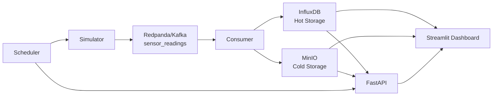

# SIEIS: Smart Indoor Environmental Intelligence System

## Abstract
The Smart Indoor Environmental Intelligence System (SIEIS) is a distributed data engineering and analytics platform for streaming environmental telemetry. The project integrates event-driven ingestion, dual-path persistence, API-based serving, dashboard-based observability, and scheduled model lifecycle operations. The objective is to support both low-latency operational monitoring and long-term analytical/ML workflows using a unified architecture.

## 1. System Architecture

### 1.1 Architectural Pattern
SIEIS follows a dual-write architecture:
- Hot path for near real-time monitoring and API queries (InfluxDB).
- Cold path for durable, partitioned, analytical storage (MinIO Parquet).

### 1.2 End-to-End Data Flow
```text
Processed Sensor File (incremental_data.txt)
        -> Simulator (threaded per mote)
        -> Redpanda/Kafka topic: sensor_readings
        -> Consumer (batch polling + transformation)
        -> InfluxDB (hot time-series store)
        -> MinIO (cold Parquet archive)

Serving Layer:
- FastAPI queries InfluxDB and serves ML inference endpoints
- Streamlit dashboard consumes InfluxDB/MinIO/API outputs

Automation Layer:
- APScheduler service restarts simulator daily and retrains/reloads anomaly model
```

### 1.3 Runtime Topology (Docker Compose)


### 1.4 Architecture Artifact Placeholder

  


## 2. Services and Port Addresses (Manual Verification)

The following table documents all externally exposed ports from the current `docker-compose.yml`.

| Service | Container | Host Port(s) | Internal Address | Manual Verification |
|---|---|---|---|---|
| Redpanda (Kafka broker) | `sieis-redpanda` | `19092`, `9092` | `redpanda:9092` | `docker exec sieis-redpanda rpk cluster info` |
| Redpanda Console | `sieis-console` | `8080` | `redpanda-console:8080` | Open `http://localhost:8080` |
| InfluxDB | `sieis-influxdb3` | `8086` | `influxdb3:8086` | Open `http://localhost:8086/health` |
| MinIO API | `sieis-minio` | `9000` | `minio:9000` | Open `http://localhost:9000/minio/health/live` |
| MinIO Console | `sieis-minio` | `9001` | `minio:9001` | Open `http://localhost:9001` |
| FastAPI | `sieis-api` | `8000` | `sieis-api:8000` | Open `http://localhost:8000/api/v1/health` |
| Streamlit Dashboard | `sieis-dashboard` | `8501` | `sieis-dashboard:8501` | Open `http://localhost:8501` |
| Scheduler | `sieis-scheduler` | none (no host bind) | internal only | `docker logs sieis-scheduler` |

Important note:
- Host-side Kafka clients should use `localhost:19092`.
- Inter-container Kafka traffic uses `redpanda:9092`.

### 2.1 Console Credentials and Login Details
Default local development credentials from the current compose configuration:

| Service | Login URL | Username | Password | Additional Details |
|---|---|---|---|---|
| Redpanda Console | `http://localhost:8080` | Not required | Not required | Kafka UI only; no auth in local setup |
| InfluxDB UI | `http://localhost:8086` | `admin` | `password123` | Org: `sieis`, Bucket: `sensor_data`, Token: `my-super-secret-token` |
| MinIO Console | `http://localhost:9001` | `minioadmin` | `minioadmin123` | API endpoint: `http://localhost:9000`, Bucket: `sieis-archive` |
| FastAPI Docs | `http://localhost:8000/docs` | Not required | Not required | Health endpoint: `http://localhost:8000/api/v1/health` |

Security note:
- These credentials are intended for local academic/development use only.
- Rotate and externalize secrets before any public or production deployment.

## 3. Local Prerequisites

### 3.1 Platform Requirements
- Operating System: Windows 10/11, Linux, or macOS
- Docker Desktop (or Docker Engine + Compose plugin)
- Python 3.11+
- Git

### 3.2 Python Dependencies
Install all Python packages from:
- `requirements.txt`

### 3.3 Required Data Files
The following files should exist before pipeline execution:
- `data/raw/mote_locs.txt`
- `data/processed/incremental_data.txt` (simulator input)
- `data/processed/historical_data.txt` (historical loading and ML utility workflows)

If processed files are absent or stale, regenerate using scripts in:
- `data/realtime_mapping/`
- `scripts/`

## 4. Procedure: Run the Project Locally

### Step 1: Clone and enter the repository
```powershell
git clone <repository-url>
cd SIEIS
```

### Step 2: (Optional but recommended) Create Python virtual environment
```powershell
python -m venv venv
.\venv\Scripts\Activate.ps1
pip install -r requirements.txt
```

### Step 3: Start full system with Docker Compose
```powershell
docker-compose up --build -d
```

### Step 4: Validate container startup
```powershell
docker ps --format "table {{.Names}}\t{{.Status}}\t{{.Ports}}"
```

Expected containers include:
- `sieis-redpanda`
- `sieis-console`
- `sieis-influxdb3`
- `sieis-minio`
- `sieis-minio-init`
- `sieis-simulator`
- `sieis-consumer`
- `sieis-api`
- `sieis-dashboard`
- `sieis-scheduler`

### Step 5: Manual service verification
1. Verify Kafka broker
```powershell
docker exec sieis-redpanda rpk cluster info
```

2. Verify InfluxDB
```powershell
curl http://localhost:8086/health
```

3. Verify MinIO
```powershell
curl http://localhost:9000/minio/health/live
```

4. Verify API
```powershell
curl http://localhost:8000/api/v1/health
```

5. Verify message flow
```powershell
docker exec sieis-redpanda rpk topic consume sensor_readings --num 5
```

6. Open web interfaces
- Redpanda Console: `http://localhost:8080`
- InfluxDB UI: `http://localhost:8086`
- MinIO Console: `http://localhost:9001`
- Dashboard: `http://localhost:8501`

### Step 6: Shut down environment
```powershell
docker-compose down
```

Remove volumes (destructive) when complete reset is required:
```powershell
docker-compose down -v
```

## 5. Local Development Execution (Without Full Compose)

For targeted debugging, services can be run directly from Python entry points:

```powershell
python -m src.app.simulator.main
python -m src.app.consumer.main
python -m src.app.api_server
python scripts/run_dashboard.py
```

Use host-compatible environment values in `.env` (for example, `localhost` endpoints) when running services outside containers.

## 6. Project Folder Structure

```text
SIEIS/
├── docker-compose.yml
├── requirements.txt
├── README.md
├── QUICKSTART.md
├── .env.example
├── data/
│   ├── raw/
│   │   └── mote_locs.txt
│   ├── processed/
│   │   ├── historical_data.txt
│   │   ├── incremental_data.txt
│   │   └── realtime_data.txt
│   └── realtime_mapping/
│       ├── transform_to_realtime.py
│       ├── preview_mapping.py
│       └── validate_output.py
├── src/
│   └── app/
│       ├── config.py
│       ├── api_server.py
│       ├── api/
│       │   ├── main.py
│       │   ├── schemas.py
│       │   └── routes/
│       │       ├── sensors.py
│       │       ├── analytics.py
│       │       └── ml.py
│       ├── simulator/
│       │   ├── main.py
│       │   ├── orchestrator.py
│       │   ├── emitter.py
│       │   ├── producer.py
│       │   └── data_loader.py
│       ├── consumer/
│       │   ├── main.py
│       │   ├── kafka_consumer.py
│       │   ├── influx_writer.py
│       │   └── parquet_writer.py
│       ├── dashboard/
│       │   ├── app.py
│       │   └── pages/
│       │       ├── 1_Realtime_Monitor.py
│       │       ├── 2_Historical_Analysis.py
│       │       └── 3_Anomaly_Detection.py
│       ├── ml/
│       │   ├── detector.py
│       │   ├── models/
│       │   │   └── model_registry.json
│       │   └── preprocessing/
│       │       └── data_prep.py
│       └── scheduler/
│           ├── main.py
│           └── jobs.py
├── scripts/
│   ├── load_historical_data.py
│   ├── split_dataset.py
│   ├── remap_timestamps.py
│   ├── train_model.py
│   ├── retrain_model.py
│   └── verify_*.py
├── tests/
│   ├── test_e2e_pipeline.py
│   ├── test_full_pipeline.py
│   ├── test_data_loader.py
│   └── test_container_*.py
└── Documentation/
    ├── ARCHITECTURE.md
    ├── DEPLOYMENT.md
    ├── ML_MODELS.md
    └── PROJECT_CONTEXT.md
```

Structure note:
- `src/app/` contains runtime services and application logic.
- `scripts/` contains operational utilities (data prep, loading, verification, model workflows).
- `data/processed/` stores the categorized datasets used to emulate archival plus incremental IoT flow.

## 7. Troubleshooting Quick Reference

- If API is healthy but dashboard is empty, verify Kafka consumption and Influx writes via `docker logs sieis-consumer`.
- If simulator produces no current records, regenerate mapped data in `data/realtime_mapping` and restart `sieis-simulator`.
- If MinIO appears empty, verify bucket initialization from `sieis-minio-init` logs.
- If model endpoints use fallback mode, train/retrain a model and call `POST /api/v1/ml/model/reload`.

## 8. Data Source and Temporal Categorization for Real-Time IoT Emulation

### 8.1 Source Dataset
SIEIS uses the Intel Lab sensor dataset (historical indoor environmental telemetry), where each record includes:
- date and time
- epoch/sample index
- mote identifier
- temperature, humidity, light, and voltage

The original dataset is historical (early 2000s), so it does not naturally behave as a present-day live stream.

### 8.2 Preprocessing and Time Remapping
To make legacy telemetry operationally useful for current-time demonstrations, the pipeline adds a derived field:
- `updated_timestamp`: a remapped timestamp aligned to the present calendar window

This preserves the original intra-series behavior (ordering and temporal spacing) while shifting records into an interpretable modern timeline.

### 8.3 Historical vs Incremental Categorization
The project organizes processed data into three artifacts under `data/processed/`:

1. `realtime_data.txt`
- Full remapped dataset (complete timeline representation).

2. `historical_data.txt`
- Archive-oriented partition (typically the older 80% block after chronological split).
- Used for backfill, long-horizon analysis, and model training workflows.
- Loaded through historical loaders into MinIO Parquet (and optionally InfluxDB as needed).

3. `incremental_data.txt`
- Stream-oriented partition (typically the newer 20% block).
- Used by the simulator as the active feed for Kafka publication.
- Represents the "arriving" portion of data to mimic ongoing sensor production.

### 8.4 Why This Mimics a Real IoT Scenario
This design reproduces the operational structure of production IoT systems:
- historical corpus retained in a cold analytical tier (MinIO/Parquet),
- incremental events continuously emitted through a message bus (Kafka/Redpanda),
- low-latency monitoring served from hot time-series storage (InfluxDB),
- periodic model retraining on accumulated historical data.

Consequently, SIEIS can emulate:
- streaming ingestion dynamics,
- online dashboard/API consumption,
- offline analytical and ML lifecycle tasks,
- and the natural separation between "already observed" and "newly arriving" telemetry.

## 9. ML Training, Retraining, and Scheduler Automation

### 9.1 ML Component Overview
SIEIS uses an Isolation Forest anomaly detector implemented in:
- `src/app/ml/detector.py`
- `src/app/ml/preprocessing/data_prep.py`

Model artifacts are stored in:
- `src/app/ml/models/anomaly_detector_*.pkl`

The active model pointer is tracked in:
- `src/app/ml/models/model_registry.json`

FastAPI serves inference and model-management endpoints:
- `POST /api/v1/ml/predict/anomaly`
- `GET /api/v1/ml/model/info`
- `POST /api/v1/ml/model/reload`

### 9.2 Initial Model Training (Manual)
Run this after historical data is available (local file or MinIO Parquet):

```powershell
python scripts/train_model.py --source minio
```

Useful variants:
```powershell
python scripts/train_model.py --source local --max-rows 200000
python scripts/train_model.py --source minio --contamination 0.03
python scripts/train_model.py --source minio --tag baseline_v1
```

What the script does:
1. Loads training data (`minio` or `local` source)
2. Prepares features (`temperature`, `humidity`, `light`, `voltage`, `hour`, `day_of_week`)
3. Trains Isolation Forest
4. Saves model artifact and updates `model_registry.json`
5. Attempts API model reload and sends a test prediction

### 9.3 Incremental Retraining (Manual)
Use retraining when new data arrives and you want to refresh model behavior:

```powershell
python scripts/retrain_model.py --source minio --days 30
```

Alternative source:
```powershell
python scripts/retrain_model.py --source influxdb --days 7
```

After retraining, reload the API model if not automatically reloaded:
```powershell
curl -X POST http://localhost:8000/api/v1/ml/model/reload
```

### 9.4 Scheduler-Based Daily Automation
The `scheduler` container (`src/app/scheduler/main.py`) runs two UTC cron jobs:

- Job A (`00:00 UTC`): `remap_and_restart`
  - Current implementation restarts `sieis-simulator`.
  - This ensures the simulator process starts a fresh emission cycle.

- Job B (`02:00 UTC`): `retrain_and_reload`
  - Loads recent data from MinIO Parquet.
  - Trains a new Isolation Forest model.
  - Saves a timestamped model with `scheduled` tag.
  - Calls API reload endpoint so inference uses the latest model without container restart.

Immediate smoke test (run both jobs on startup):
```powershell
docker compose up -d scheduler
docker compose down scheduler
RUN_JOBS_ON_START=true docker compose up scheduler
```

Scheduler runtime configuration is controlled by environment variables in `docker-compose.yml`, including:
- `SCHEDULER_TIMEZONE`
- `JOB_A_HOUR`, `JOB_A_MINUTE`
- `JOB_B_HOUR`, `JOB_B_MINUTE`
- `RUN_JOBS_ON_START`

### 9.5 Verification After Training/Retraining
1. Confirm API sees the model:
```powershell
curl http://localhost:8000/api/v1/ml/model/info
```

2. Confirm health includes model-loaded state:
```powershell
curl http://localhost:8000/api/v1/health
```

3. Confirm scheduler execution logs:
```powershell
docker logs sieis-scheduler --tail 200
```

4. Confirm new model files are created:
```powershell
Get-ChildItem src\\app\\ml\\models\\anomaly_detector_*.pkl | Sort-Object LastWriteTime -Descending | Select-Object -First 5
```
